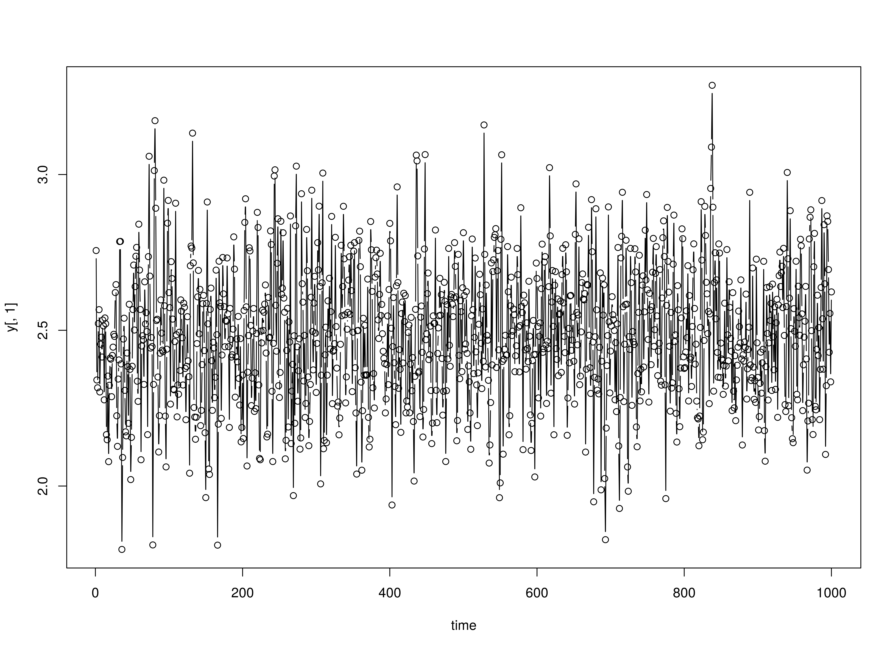

## Load package


```r
library(simAutoReg)
```

## Set arguments


```r
time <- 1000L
burn_in <- 200L
constant <- 2
coef <- c(0.5, -0.3)
sd <- 0.1
p <- length(coef)
```

## Generate data


```r
set.seed(42)
y <- SimAR(
  time = time,
  burn_in = burn_in,
  constant = constant,
  coef = coef,
  sd = sd
)
```

## Plot


```r
plot(x = 1:time, y = y[, 1], type = "b", xlab = "time")
```



## Estimate parameters


```r
yx <- YX(data = y, p = p)
Y = yx$Y
X = yx$X
simAutoReg:::.FitVAROLS(Y = Y, X = X)
#>          [,1]      [,2]       [,3]
#> [1,] 2.016592 0.5143625 -0.3232389
```
