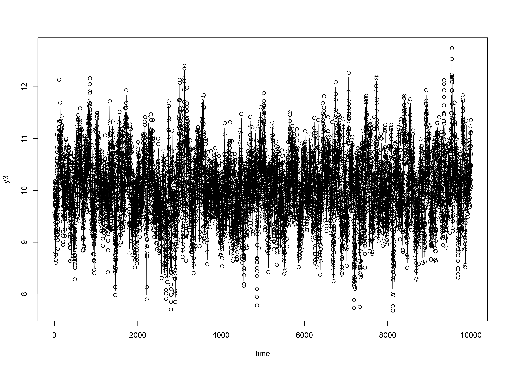
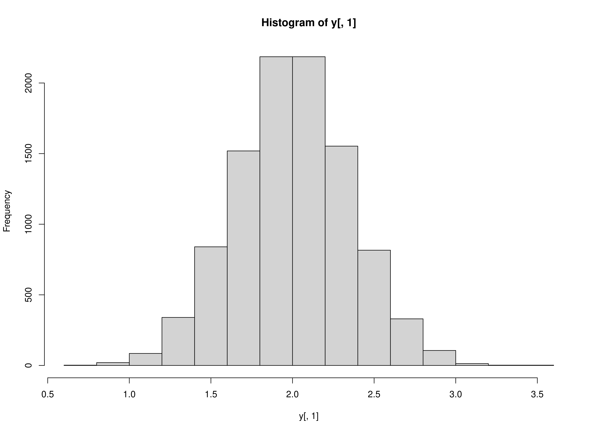
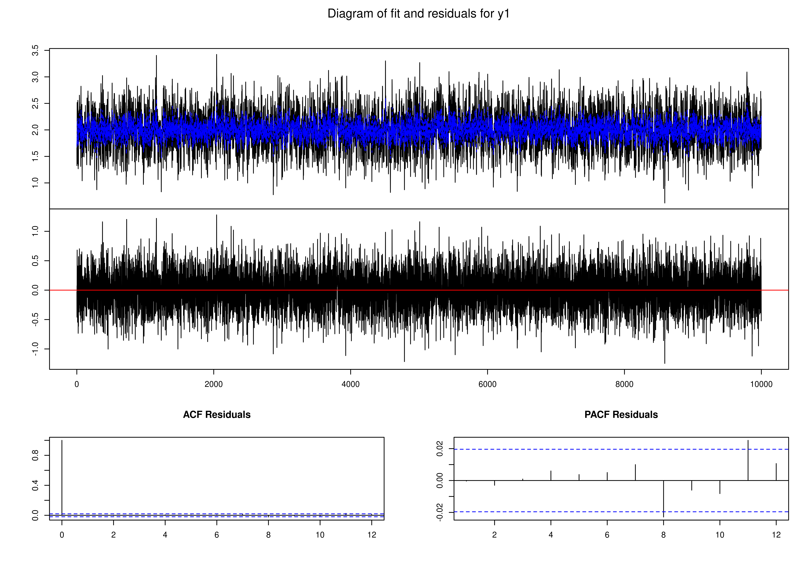
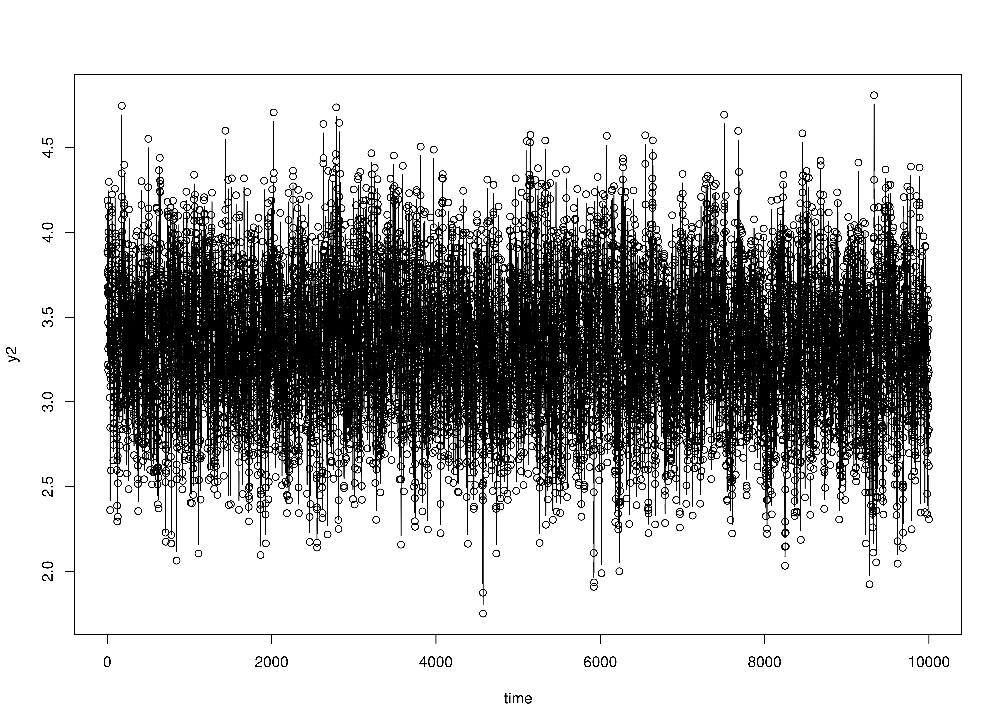
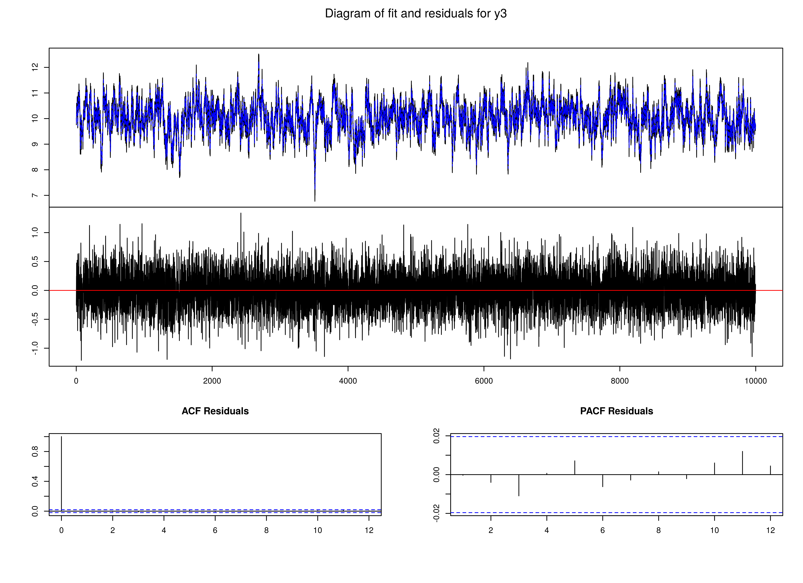

## Data Generation

### Normal


```r
library(simAutoReg)
set.seed(42)
time <- 10000L
burn_in <- 200
k <- 3
p <- 2
constant <- c(1, 1, 1)
coef <- matrix(
  data = c(
    0.4, 0.0, 0.0, 0.1, 0.0, 0.0,
    0.0, 0.5, 0.0, 0.0, 0.2, 0.0,
    0.0, 0.0, 0.6, 0.0, 0.0, 0.3
  ),
  nrow = k,
  byrow = TRUE
)
chol_cov <- chol(
  matrix(
    data = c(
      0.1, 0.0, 0.0,
      0.0, 0.1, 0.0,
      0.0, 0.0, 0.1
    ),
    nrow = k,
    byrow = TRUE
  )
)
y <- SimVAR(
  time = time,
  burn_in = burn_in,
  constant = constant,
  coef = coef,
  chol_cov = chol_cov
)
```

##  Model Fitting

### FitVAROLS


```r
yx <- YX(data = y, p = p)
FitVAROLS(Y = yx$Y, X = yx$X)
#>            [,1]       [,2]       [,3]       [,4]       [,5]       [,6]
#> [1,] 0.41516397 0.04609430 0.02858174 0.14227185 0.01618454 0.03857114
#> [2,] 0.01760307 0.54341912 0.02703281 0.03924607 0.23419850 0.03533042
#> [3,] 0.01550961 0.03845888 0.63462768 0.04805456 0.01222709 0.33562745
```

### vars::VAR


```r
fit <- vars::VAR(y, p = p, type = "const")
#> Warning in vars::VAR(y, p = p, type = "const"): No column names supplied in y, using: y1, y2, y3 , instead.
fit
#> 
#> VAR Estimation Results:
#> ======================= 
#> 
#> Estimated coefficients for equation y1: 
#> ======================================= 
#> Call:
#> y1 = y1.l1 + y2.l1 + y3.l1 + y1.l2 + y2.l2 + y3.l2 + const 
#> 
#>        y1.l1        y2.l1        y3.l1        y1.l2        y2.l2        y3.l2 
#>  0.381495824  0.014493688 -0.008235351  0.107271863 -0.014818614  0.002528288 
#>        const 
#>  1.081177822 
#> 
#> 
#> Estimated coefficients for equation y2: 
#> ======================================= 
#> Call:
#> y2 = y1.l1 + y2.l1 + y3.l1 + y1.l2 + y2.l2 + y3.l2 + const 
#> 
#>        y1.l1        y2.l1        y3.l1        y1.l2        y2.l2        y3.l2 
#> -0.010672062  0.516880335 -0.003886862  0.009852424  0.208161477  0.005060958 
#>        const 
#>  0.907993200 
#> 
#> 
#> Estimated coefficients for equation y3: 
#> ======================================= 
#> Call:
#> y3 = y1.l1 + y2.l1 + y3.l1 + y1.l2 + y2.l2 + y3.l2 + const 
#> 
#>        y1.l1        y2.l1        y3.l1        y1.l2        y2.l2        y3.l2 
#> -0.016192833  0.008703253  0.599960140  0.015098029 -0.016965956  0.301688940 
#>        const 
#>  1.018053673
plot(fit)
```



### Zero-inflated Poisson


```r
y <- SimVARZIP(
  time = time,
  burn_in = burn_in,
  constant = constant,
  coef = coef,
  chol_cov = chol_cov
)
hist(y[, 1])
```



##  Model Fitting

### FitVAROLS


```r
yx <- YX(data = y, p = p)
FitVAROLS(Y = yx$Y, X = yx$X)
#>               [,1]       [,2]       [,3]          [,4]        [,5]        [,6]
#> [1,]  0.0116075361 0.01603456 0.11563400  0.0014639055 -0.01693222 -0.03847647
#> [2,]  0.0016709977 0.54238590 0.05045897 -0.0002872820  0.22225486  0.02740053
#> [3,] -0.0004112122 0.04453708 0.66357493 -0.0005013604  0.02516158  0.31300278
```

### vars::VAR


```r
fit <- vars::VAR(y, p = p, type = "const")
#> Warning in vars::VAR(y, p = p, type = "const"): No column names supplied in y, using: y1, y2, y3 , instead.
fit
#> 
#> VAR Estimation Results:
#> ======================= 
#> 
#> Estimated coefficients for equation y1: 
#> ======================================= 
#> Call:
#> y1 = y1.l1 + y2.l1 + y3.l1 + y1.l2 + y2.l2 + y3.l2 + const 
#> 
#>        y1.l1        y2.l1        y3.l1        y1.l2        y2.l2        y3.l2 
#>  0.011590723  0.009087347  0.108111765  0.001443185 -0.023903648 -0.045984398 
#>        const 
#>  0.197666234 
#> 
#> 
#> Estimated coefficients for equation y2: 
#> ======================================= 
#> Call:
#> y2 = y1.l1 + y2.l1 + y3.l1 + y1.l2 + y2.l2 + y3.l2 + const 
#> 
#>         y1.l1         y2.l1         y3.l1         y1.l2         y2.l2 
#>  0.0015885479  0.5083170601  0.0135702220 -0.0003888942  0.1880672752 
#>         y3.l2         const 
#> -0.0094180712  0.9693473394 
#> 
#> 
#> Estimated coefficients for equation y3: 
#> ======================================= 
#> Call:
#> y3 = y1.l1 + y2.l1 + y3.l1 + y1.l2 + y2.l2 + y3.l2 + const 
#> 
#>         y1.l1         y2.l1         y3.l1         y1.l2         y2.l2 
#> -0.0004950656  0.0098883061  0.6260582512 -0.0006047023 -0.0096079532 
#>         y3.l2         const 
#>  0.2755574404  0.9858478576
plot(fit)
```


