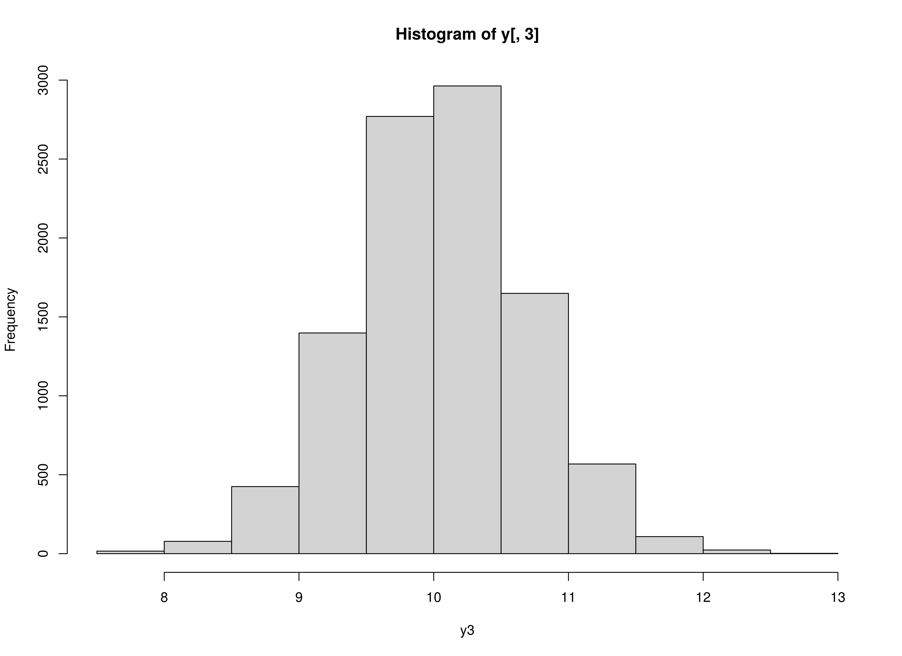
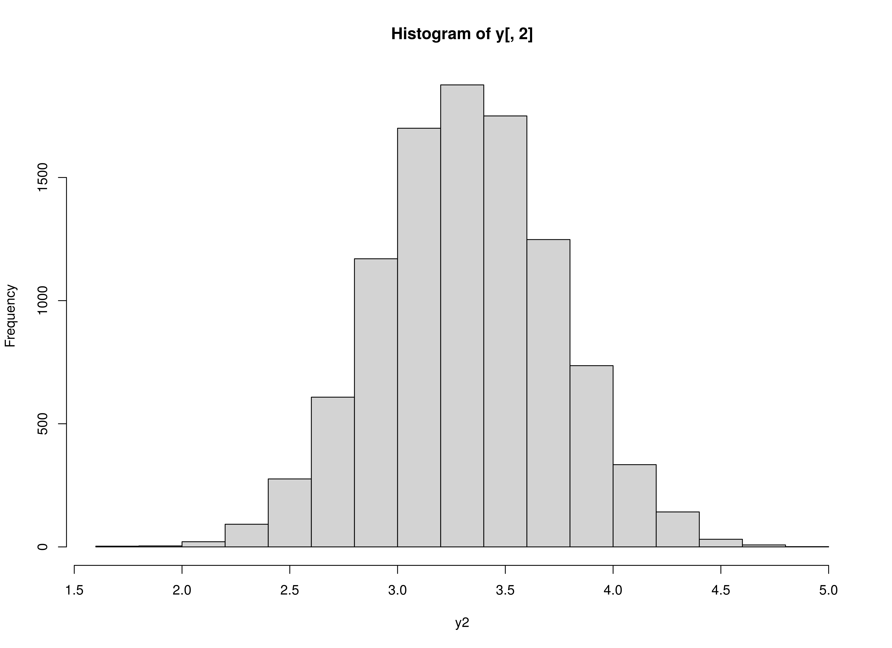

## Data Generation

### Normal


```r
library(simAutoReg)
set.seed(42)
time <- 10000L
burn_in <- 200
k <- 3
p <- 2
constant <- c(1, 1, 1)
coef <- matrix(
  data = c(
    0.4, 0.0, 0.0, 0.1, 0.0, 0.0,
    0.0, 0.5, 0.0, 0.0, 0.2, 0.0,
    0.0, 0.0, 0.6, 0.0, 0.0, 0.3
  ),
  nrow = k,
  byrow = TRUE
)
chol_cov <- chol(
  matrix(
    data = c(
      0.1, 0.0, 0.0,
      0.0, 0.1, 0.0,
      0.0, 0.0, 0.1
    ),
    nrow = k,
    byrow = TRUE
  )
)
y <- SimVAR(
  time = time,
  burn_in = burn_in,
  constant = constant,
  coef = coef,
  chol_cov = chol_cov
)
```

##  Model Fitting

### FitVAROLS


```r
yx <- YX(data = y, p = p)
simAutoReg:::.FitVAROLS(Y = yx$Y, X = yx$X)
#>           [,1]        [,2]        [,3]         [,4]        [,5]        [,6]
#> [1,] 1.0811778  0.38149582 0.014493688 -0.008235351 0.107271863 -0.01481861
#> [2,] 0.9079932 -0.01067206 0.516880335 -0.003886862 0.009852424  0.20816148
#> [3,] 1.0180537 -0.01619283 0.008703253  0.599960140 0.015098029 -0.01696596
#>             [,7]
#> [1,] 0.002528288
#> [2,] 0.005060958
#> [3,] 0.301688940
```

### Plots


```r
plot(x = 1:nrow(y), y = y[, 1], type = "b", xlab = "time", ylab = "y1")
```


```r
plot(x = 1:nrow(y), y = y[, 2], type = "b", xlab = "time", ylab = "y2")
```


```r
plot(x = 1:nrow(y), y = y[, 3], type = "b", xlab = "time", ylab = "y3")
```


```r
hist(y[, 1], xlab = "y1")
```


```r
hist(y[, 2], xlab = "y2")
```


```r
hist(y[, 3], xlab = "y3")
```



### Zero-inflated Poisson Y1


```r
y <- SimVARZIP(
  time = time,
  burn_in = burn_in,
  constant = constant,
  coef = coef,
  chol_cov = chol_cov
)
```

##  Model Fitting

### FitVAROLS


```r
yx <- YX(data = y, p = p)
simAutoReg:::.FitVAROLS(Y = yx$Y, X = yx$X)
#>           [,1]          [,2]        [,3]       [,4]          [,5]         [,6]
#> [1,] 0.1976662  0.0115907232 0.009087347 0.10811177  0.0014431850 -0.023903648
#> [2,] 0.9693473  0.0015885479 0.508317060 0.01357022 -0.0003888942  0.188067275
#> [3,] 0.9858479 -0.0004950656 0.009888306 0.62605825 -0.0006047023 -0.009607953
#>              [,7]
#> [1,] -0.045984398
#> [2,] -0.009418071
#> [3,]  0.275557440
```

### Plots


```r
plot(x = 1:nrow(y), y = y[, 1], type = "b", xlab = "time", ylab = "y1")
```


```r
plot(x = 1:nrow(y), y = y[, 2], type = "b", xlab = "time", ylab = "y2")
```


```r
plot(x = 1:nrow(y), y = y[, 3], type = "b", xlab = "time", ylab = "y3")
```


```r
hist(y[, 1], xlab = "y1")
```


```r
hist(y[, 2], xlab = "y2")
```



```r
hist(y[, 3], xlab = "y3")
```


